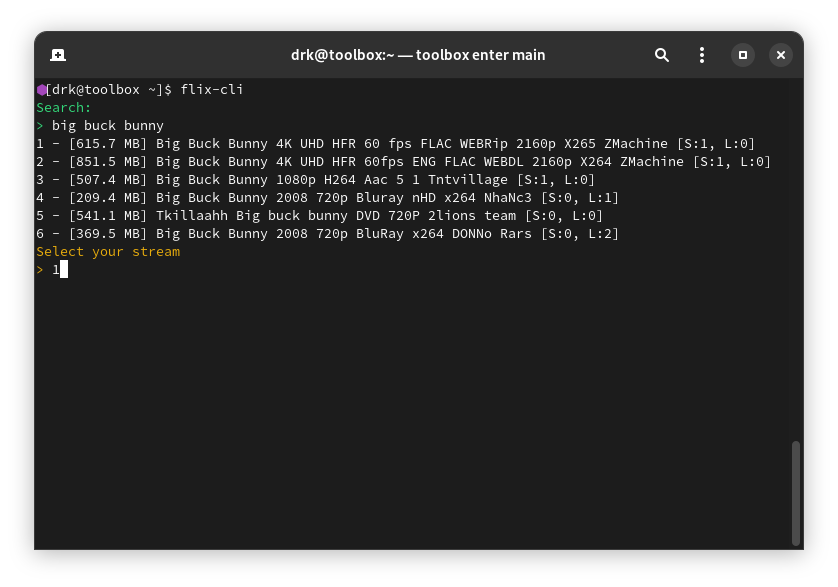

# flix-cli

flix-cli is a command-line tool for searching and streaming movies using magnet links and [peerflix](https://github.com/mafintosh/peerflix).

## How It Works

flix-cli is a bash script that scrapes movies from 1337x to retrieve magnet links, enabling you to stream movies directly in your terminal using mpv and peerflix. The script relies on GNU utilities such as sed, awk, paste, and cut. Make sure you have the latest version of npm installed.

## Warning

- **Use a VPN:** This script retrieves torrents from 1337x, which is of course a torrent site that ISPs usually don't like. Always use a VPN.
- **NSFW Content:** The script doesn't filter out NSFW content. Be cautious.
- **No Series Support:** Currently, the script does not support TV series and will play a random episode if a series is searched. A workaround is to search for specific episodes.

## Requirements

- npm
- [peerflix](https://github.com/mafintosh/peerflix)
- mpv
- make

## Usage

To search for a movie, use the following command:

```sh
$ flix-cli <search>
```

Alternatively, you can enter the program to get a search prompt by simply typing `flix-cli`. The search results will be displayed in the following format:



- **First column:** Total size of the file.
- **Second column:** Name of the torrent (including details like quality, video codec, audio codec, etc.).
- **Third column:** Seeders and leechers.

## Installation

Ensure all dependencies are installed via your package manager.

### Automatic Installation

You can use the included `install.sh` script for automatic installation. This script will ask you your sudo password for root privileges, if you want to know why, take a look at the manual installation.

```sh
$ git clone https://gitlab.com/d4r1us-drk/flix-cli.git
$ cd flix-cli
$ ./install.sh
```

### Manual Installation

1. Install peerflix globally using npm:

    ```sh
    $ sudo npm install -g peerflix
    ```

2. Clone the repository and install the script:

    ```sh
    $ git clone https://gitlab.com/d4r1us-drk/flix-cli.git
    $ cd flix-cli
    $ sudo make install
    ```

## Uninstallation

To uninstall flix-cli, clone the repository if necessary and run the uninstall command:

```sh
$ sudo make uninstall
```

## Alternatives

Here are some alternatives for streaming other types of content:

- **Anime:** [ani-cli by pystardust](https://github.com/pystardust/ani-cli)
- **YouTube:** [ytfzf by pystardust](https://github.com/pystardust/ytfzf)

## License

This project is licensed under the [GPL-3.0 License](https://raw.githubusercontent.com/Illumina/licenses/master/gpl-3.0.txt).
