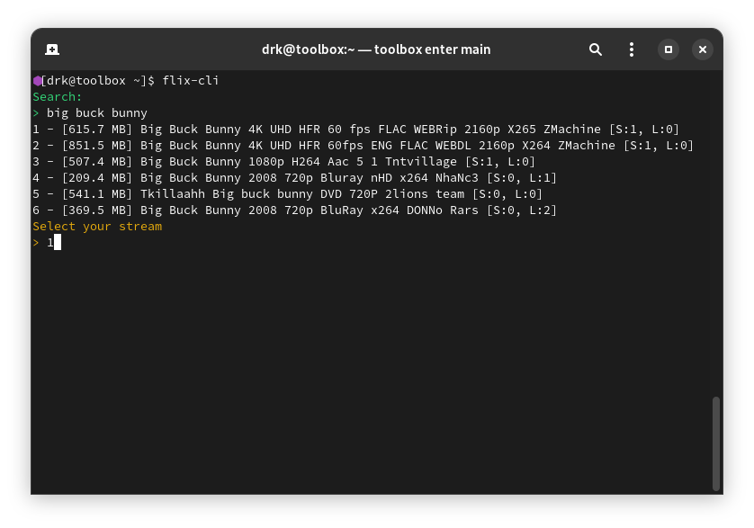

<h1 align="center">flix-cli</h1>
<p align="center">flix-cli is a tool which search magnet links and stream it with peerflix</p>

### How does this work?
This is a bash script. It scrapes movies from 1337x and gets the magnet link. Yes, movies on the terminal.
After this it uses [peerflix](https://github.com/mafintosh/peerflix) to stream the video from the magnet link to mpv.
For scraping, the script uses simple gnu utils like sed, awk, paste, cut. It's recommended to install the lastest version of npm.

## WARNING
- **This script will pull out torrents from 1337x which is a very special site, so please use a VPN when using it.**
- **This script doesn't filter out any content yet, be careful with NSFW related content.**
- This script doesn't support series yet, if you try to watch a series, it will just play a random episode.

## Requirements
* npm
* [peerflix](https://github.com/mafintosh/peerflix)
* mpv
* make

## Usage
This script is really simple to use, you can type:
``` sh
$ flix-cli <search>
```
Or you can enter the program to get a search prompt by typing `flix-cli`
When searching you'll get this output format:

- First column: Total Size of the file.
- Second column: Name of the torrent (Most of the time it will include the quality, video codec, audio codec, etc).
- Third column: Seeders and Leechers.

## Installation
Make sure you have the dependencies installed. If not, install them using your package manager.

### Automatic Installation
You can use the included install.sh script to install this program.
Keep in mind that the installation requires you to put your password for sudo privileges. If you want to know why, take a look at the manual installation.
```sh
$ git clone https://gitlab.com/d4r1us-drk/flix-cli.git     # clone the repo
$ cd flix-cli                                              # cd into it
$ ./install.sh                                             # install the script
```

### Manual Installation
* First install peerflix using npm, this will put it in the /usr/local/bin directory, to make this a global installation.
```sh
$ sudo npm install -g peerflix                     # install peerflix using npm
```
* Finally clone the repo, go into it, and run the install command.
```sh
$ git clone https://gitlab.com/d4r1us-drk/flix-cli.git     # clone the repo
$ cd flix-cli                                              # cd into it
$ sudo make install                                        # install the script
```

## Uninstall
Clone the repo again if you deleted it, and run the following command.
```sh
$ sudo make uninstall                             # while being inside the repo
```

## Alternatives
Here's a breef list of alternatives for other type of contents.
- To watch anime on the terminal: [pystardust's ani-cli](https://github.com/pystardust/ani-cli "ani-cli")
- To watch youtube videos on the terminal: [pystardust's ytfzf](https://github.com/pystardust/ytfzf "ytfzf")

## License
This project is licensed under [GPL-3.0](https://raw.githubusercontent.com/Illumina/licenses/master/gpl-3.0.txt).
